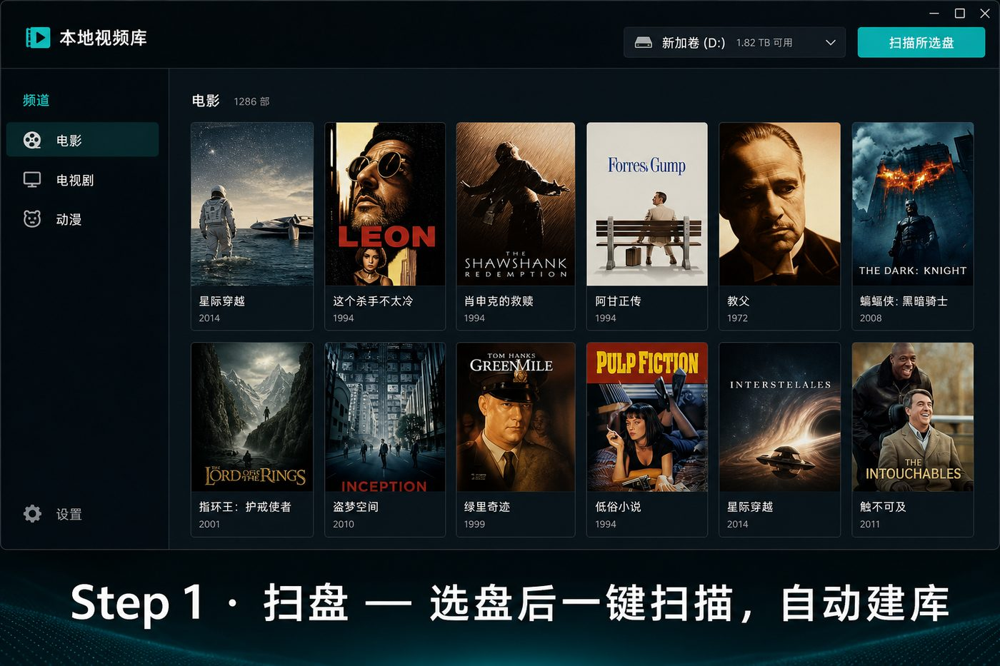
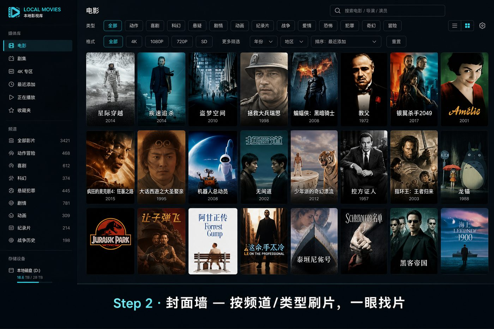
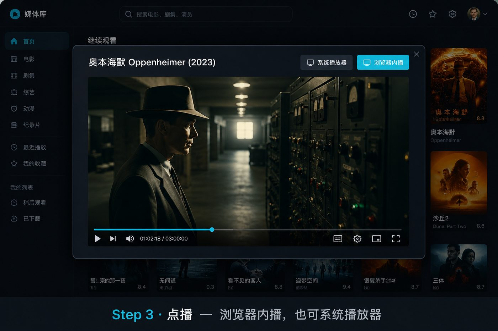

# 本地视频库 · 硬盘片库变「私人影院」

> **宅男神器**：不用上传、不收会员、不看广告——硬盘里堆了几百 GB 电影 / 动漫 / 剧集？双击一下，立刻变成能筛选、有封面、能点播的本地片站。

[](docs/how-it-works.md)

**三步上手**（[图文说明](docs/how-it-works.md)）

| 1. 扫盘 | 2. 封面墙 | 3. 点播 |
|:---:|:---:|:---:|
|  |  |  |

**下载免安装包** → [GitHub Releases](https://github.com/cheng2016/video-gallery/releases)（解压后双击 `Start-VideoGallery.bat`）

资源管理器翻文件夹找片？文件名一长就眼花？换电脑又要从头翻？  
这个工具专门解决「**本地盘太多、想看却难找**」。

---

## 为什么选它（核心优势）

| 优势 | 你真实能感受到的差别 |
|------|----------------------|
| **完全本地、零上传** | 片在自己硬盘，服务只跑 `127.0.0.1`，不碰云、不联网也能用 |
| **像流媒体一样逛** | 封面墙 + 频道 + 类型 + 格式筛选，不再对着一堆 `xxx.mkv` 发呆 |
| **扫一次，长期秒开** | 预览图和索引缓存在程序目录；下次扫描同一盘几乎瞬间进库 |
| **硬盘随便插** | 换盘符、换移动硬盘都能扫；删了的片自动从列表消失 |
| **难播格式也能管** | 浏览器播不了？一键系统播放器；m3u8 / TS 流还能一键转成同目录 MP4 |
| **能导出纯静态站** | 生成 `index.html`，U 盘拷走、别的电脑直接打开浏览——**不用再装 Python** |
| **安装极简** | Windows 有免安装包；Windows/macOS 源码模式均提供双击启动器 |

一句话：**把「文件夹」升级成「片库」**，隐私、速度、可控，全在你手上。

---

## 适合谁

- 下载盘 / 影视盘 / 移动硬盘囤片的人  
- 想给家里 NAS 或外置盘做一个「能点的封面墙」  
- 需要把片库拷给朋友、却不想让对方装一堆软件  
- 嫌 Emby / Jellyfin 太重，只想要一个轻量本机方案  

---

## 使用后你会得到什么

| 产物 | 说明 |
|------|------|
| 私人网页片库 | 浏览器打开 http://127.0.0.1:8765，按频道 / 类型 / 格式刷片、点播 |
| 预览图墙 | 默认加密缓存在程序目录；可在「隐私」改为明文或写到视频盘 |
| 隐私可控 | 预览图是否加密、缓存是否离开视频盘，囤片可按需关 |
| 中文反馈 | Issues 模板覆盖「扫不到 / 没声音 / 封面错」，少来回问 |
| 持久索引 | 再次打开同一盘：优先读缓存，增量更新，少等冤枉时间 |
| 离线静态站（可选） | 视频盘下 `_video_gallery_static\`，双击 `index.html` 就能逛 |


---

## 使用环境

| 项目 | 要求 |
|------|------|
| 系统 | **Windows 10 / 11**；**macOS 13+**（Intel / Apple Silicon，源码模式） |
| Python | **3.10+**（源码模式；免安装版不需要） |
| 依赖 | 首次运行 Windows `start.bat` 或 macOS `start.command` 自动安装 |
| ffmpeg | **强烈推荐**；Windows：`winget install ffmpeg`，macOS：`brew install ffmpeg` |
| 浏览器 | Chrome / Edge / Safari 等；部分 mkv/avi 建议用页面里的系统播放器 |
| 网络 | **不需要外网** |

电脑能跑 Python 就行；盘接本机或 USB 最快，网络盘也能扫会慢一些。

---

## 30 秒上手

### 方式 A：免安装版（推荐给最终用户）

1. 解压发布包到任意目录（内含 `VideoGallery.exe`）  
2. （推荐）`winget install ffmpeg` —— 预览图 / 转码需要  
3. 双击 **`Start-VideoGallery.bat`**（或直接运行 `VideoGallery.exe`）  
4. 打开 http://127.0.0.1:8765 → 选盘 →「扫描所选盘」  

> 发布包**不内置** ffmpeg（体积与许可原因）。未安装时仍可浏览与播放，状态栏会提示。
> 多块盘可分别扫描，会自动加入同一片库；侧栏频道按盘分组。

### 方式 B：源码 / Windows

1. 装 [Python 3.10+](https://www.python.org/downloads/)（勾选 Add to PATH）  
2. （推荐）`winget install ffmpeg`  
3. 双击 **`start.bat`**  
4. 打开 http://127.0.0.1:8765 → 选盘 →「扫描所选盘」  

关掉黑色窗口 = 停止服务。

### 方式 C：源码 / macOS

1. 安装 [Python 3.10+](https://www.python.org/downloads/macos/)。
2. 推荐先安装 Homebrew，再运行 `brew install ffmpeg`。
3. Finder 中双击 **`start.command`**；若被 Gatekeeper 拦截，右键该文件选择“打开”。
4. 也可在终端运行 `./start.sh ~/Movies`。
5. 页面会列出 `~/Movies`、`~/Videos`（存在时）和 `/Volumes` 下的外置卷。

首次扫描受保护目录时，请按 macOS 提示允许访问。开启局域网分享后若其它设备无法连接，请在“系统设置 → 网络 → 防火墙 → 选项”中允许 Python 接收传入连接。

### 自行打包免安装版

```bat
build.bat
```

产出：`dist\VideoGallery\`（含 `VideoGallery.exe` + `Start-VideoGallery.bat`）。将整个文件夹打成 zip 即可分发。  
构建依赖见 `requirements-dev.txt`（含 `pyinstaller`）。

---

## 功能一览

- 磁盘/目录：**扫描所选项**（新磁盘自动加入片库）/ **重新扫描**（增量）
- 左侧频道：多盘时按盘展开；单盘时按一级文件夹（电影、电视剧、动漫…）  
- 筛选：排序、**合集 / 单集**视图、类型（动作/恐怖/爱情…有片才显示）、格式、**多层子类**  
  - 合集视图：识别 `S01E02` / `第2集` / `EP02` 等，≥2 集合成一张卡，点开再选分集  
  - 选中有子目录的分类：默认勾选「全部」，看该目录下整棵子树  
  - 取消「全部」：只看本层根目录的片  
  - 下滑后吸顶保留**当前那一行**筛选标签，可点「筛选」回到完整筛选区  
- **搜索更强**：拼音 / 首字母（如 `xingji` / `xj`）；文件名里能抠的演员会进索引；语法过滤：
  - `ext:mkv` / `type:mp4`
  - `genre:动作` / `g:科幻`
  - `actor:周迅` / `a:张三`
  - `channel:电影`  
- 播放：浏览器内播；**TS / m3u8 走本机 HLS**  
  - 有 `index.m3u8` 时按列表内容识别真正的分片，不误伤同目录大体积独立 `.ts`  
  - 多个小 TS、无播放列表时自动合成一条流入口  
- **一键转 MP4**（动态站）：播放 m3u8 / TS 合集时可转成同目录 `.mp4`（需 ffmpeg；优先无损封装，失败再转码）  
  - 转完自动加入片库（无需全盘重扫）；可取消；有时长时显示进度百分比  
- **修复声音**（动态站）：浏览器播片没声音多半是 AC3/DTS 等音轨不兼容；点「修复声音」会视频直拷、音频转 AAC，生成 `*_browser.mp4` 入库；也可直接用「系统播放器」  
- **记忆筛选与进度**：频道 / 子类 / 排序 / 视图等写进本地；再次打开同一片可从上次位置续播  
- **疑似重复提示**：同名或同体积的片在封面角标「重复」  
- **片库清理**：顶栏「清理」→ 重复组默认勾选待删、标出「保留·最新」，可「只留最新 / 只留最大 / 只留这个」后移回收站  
- **局域网分享**：顶栏「局域网」**即时开关**（无需重启）；开启时尝试自动放行防火墙。手机/电视打开状态栏或弹窗里的 `http://电脑IP:8765`  
- **隐私模式**：顶栏「隐私」——可关预览图加密；可选缓存写在程序目录或视频盘内 `.video_gallery_cache`  
- **反馈入口**：顶栏「反馈」→ GitHub Issues（中文模板：扫不到 / 没声音 / 封面错）  
- **观看历史**：顶栏「历史」+ 列表上方「继续看」；记录看到一半 / 已看完（仅本机浏览器）  
- **损坏检测**：扫描后后台用 ffprobe 轻量探测，打不开的片标「损坏」  
- **时长进列表**：自动补时长，可按「最长 / 最短」排序；封面角标优先显示时长  
- **超大库更流畅**：片多时只渲染可视区域封面（虚拟列表），滚动更轻  
- 本地操作：系统播放器、Finder/文件管理器定位、复制路径
- **导出静态站**：封面规则与动态站一致，同样支持合集/单集切换，拷走即用  
- 侧栏可隐藏，专注刷片  
- 扫描时自动跳过过小的假视频（如几 KB 的 `.mp4`）；`.m3u8` 与正常 TS 分片不受影响  

---

## 缓存怎么工作

| 操作 | 行为 |
|------|------|
| 重启 / 扫描所选项 | 读缓存索引，不重复截图 |
| 重新扫描 | 全盘重扫；已有预览图仍复用 |
| 导出静态站 | 已有缩略图直接复用 |
| 删了的视频 | 加载时自动从列表去掉 |

**默认**缓存位置：与 `app.py` / exe 同级的 `preview_cache\`（例如 `D:\video-gallery\preview_cache\`），预览图默认加密（`.vgt`，不能当普通图片打开）。

可在顶栏 **「隐私」** 调整：

| 选项 | 说明 |
|------|------|
| 加密预览图 | 开=加密混淆；关=明文 JPEG（仍用 `.vgt` 扩展名） |
| 程序目录缓存 | 不污染视频盘（推荐） |
| 视频盘内缓存 | 写到各盘 `.video_gallery_cache`，盘带走封面也在 |

改缓存位置后请 **重新扫描** 一次，让索引落到新路径。

---

## 遇到问题怎么反馈

优先用软件顶栏 **「反馈」**，或打开：  
https://github.com/cheng2016/video-gallery/issues/new/choose  

已准备中文模板，按场景选即可：

- **扫不到视频**
- **播放没声音**
- **封面 / 预览图不对**
- **其它 Bug**

---

## 类型怎么认出来的

看路径和文件名，例如：

```text
电影\动作\xxx.mp4
恐怖片\某某.mkv
```

没命中的类型不会出现在筛选栏——列表永远干净。

---

## 示例片库 / 演示

- 图文三步：[docs/how-it-works.md](docs/how-it-works.md)  
- 示例目录结构：[samples/demo-library](samples/demo-library/)（放入你自己的短片后扫描即可演示）  
- 打 Release：推送 `v*` 标签，或看 [docs/release.md](docs/release.md)

---

## 命令行（可选）

Windows：

```bat
start.bat
start.bat E:\电影
.venv\Scripts\python.exe app.py "E:\电影" --port 8765
.venv\Scripts\python.exe app.py --rescan
```

macOS：

```sh
./start.sh
./start.sh ~/Movies
.venv/bin/python app.py "/Volumes/Media" --port 8765
.venv/bin/python app.py --rescan
```

核心逻辑在 `vg/` 包（扫描、转换、路由等）；根目录 `app.py` 只做启动入口，`run.py` 负责两种系统的源码环境。

---

## 支持格式

mp4 / mkv / avi / mov / wmv / flv / webm / m4v / ts / m3u8 …

- 浏览器播不动的，用「系统播放器」；m3u8 / TS 合集可 **转成 H.264 MP4**；有画面没声音可点 **修复声音**（需已安装 ffmpeg）  
- 体积过小的「假后缀」视频文件会被扫描忽略，避免列表里一堆不能播的垃圾  

---

**硬盘已经替你囤好了世界，缺的只是一个像样的入口。**  
运行 Windows `start.bat` 或 macOS `start.command`，开始建造你的私人影院。
